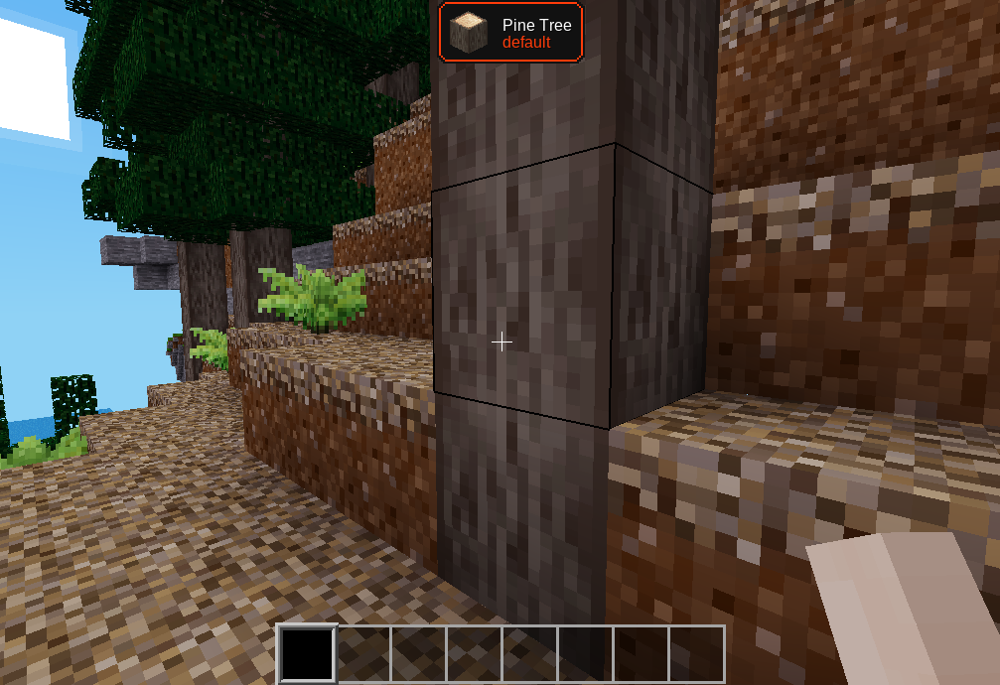
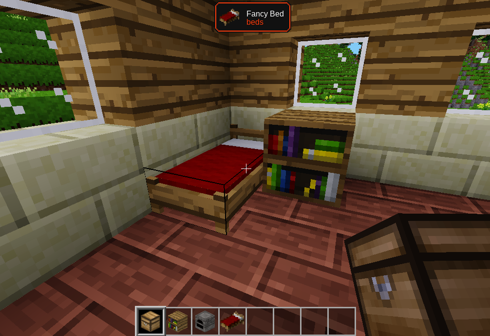
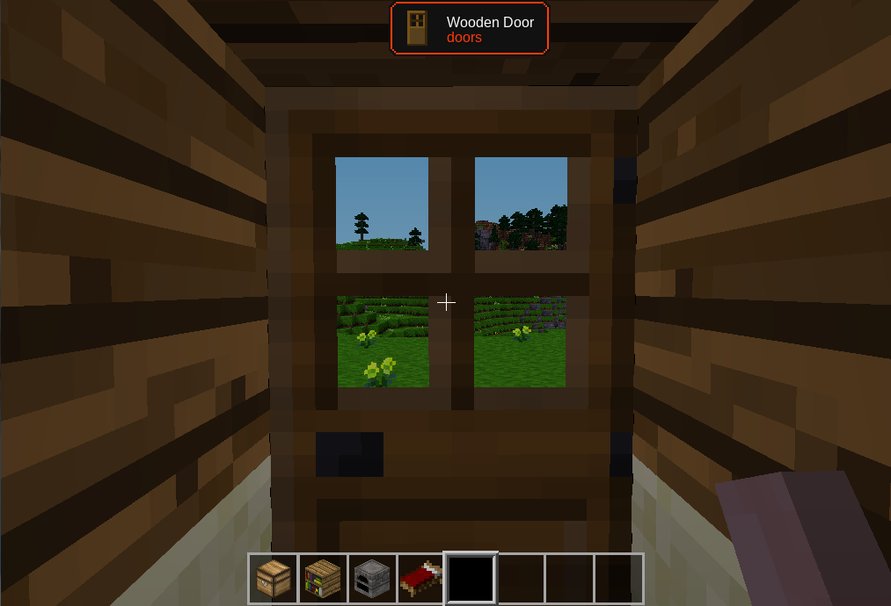

# What is this? OwO

A mod that says at the top of your screen what you're looking at.

## version 1.1.2:

Now we have two versions: the "OwO" and the "UwU".
The "OwO" version shows at the top of the screen what you punched, thus saving resources for the server.
The "UwU" version shows what you're looking at very similarly to minecraft's "Waila" but would spend a lot of resources on a server.

## Screenshots:







## Chatcommands

To unshow thw pop-up, typed this in console:

```
/witowo
```

And typed again to show.

Enjoy! 🦊
